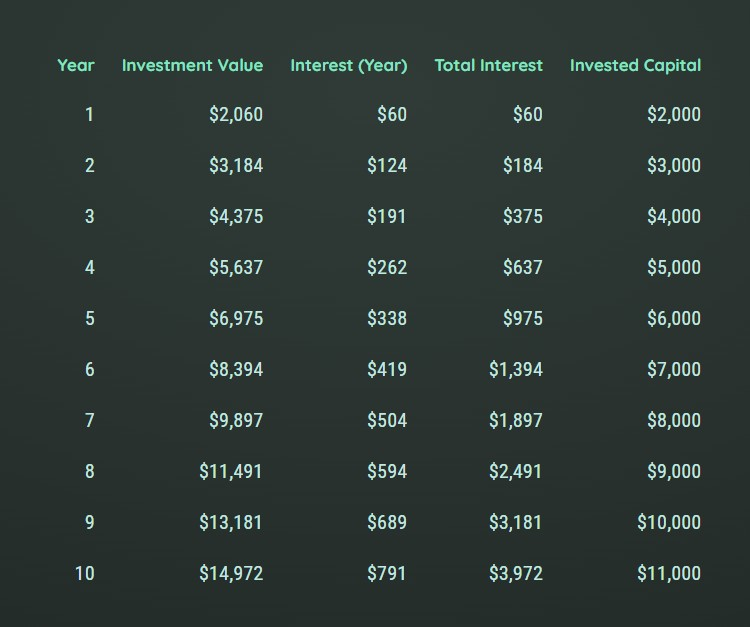

# 📈 Simple Investment Calculator

A simple and intuitive React web application that allows users to estimate investment growth over time. Enter an initial amount, interest rate, and see results calculated and displayed in a clear, tabular format.

---

## ✨ Features

- Input initial investment, annual return rate, and duration
- Automatically computes yearly balance and interest accumulation
- Displays results in a responsive, easy-to-read table
- React-based SPA with reusable components and smooth user flow

---

## 🧱 Tech Stack

- React  
- JavaScript (ES6+)  
- HTML + CSS Modules or Styled Components (optional)  

---

## 📸 Screenshots

**Input Screen**  
<p align="left">
  
</p>

**Results Screen**  
<p align="left">
  
</p>

---

## 🚀 Installation

```bash
git clone <repository-url>
cd investment-calculator-web
npm install
npm start
```

> **Note**: Requires Node.js and a modern browser.  

---

## 📁 Project Structure

```
/components       # Reusable UI components  
/App.js           # Main application entry point  
```

--
